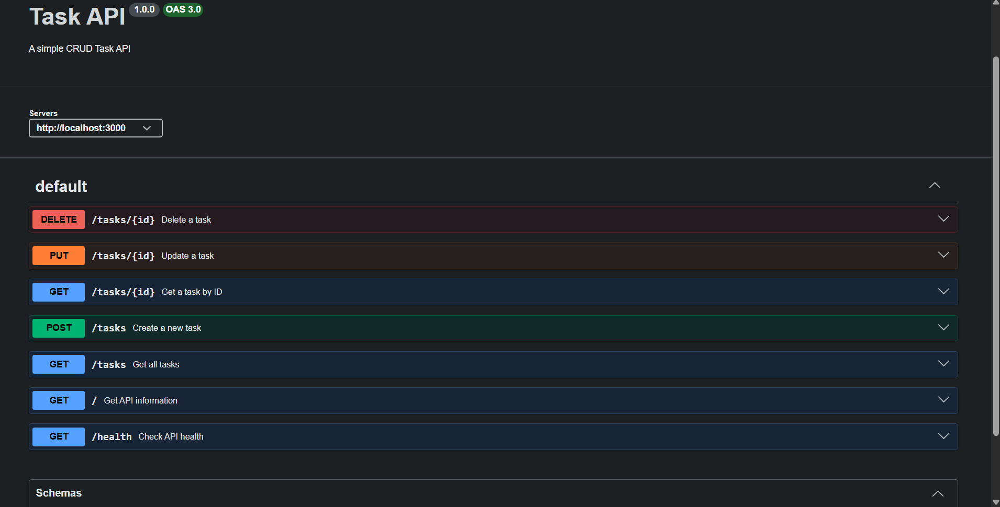
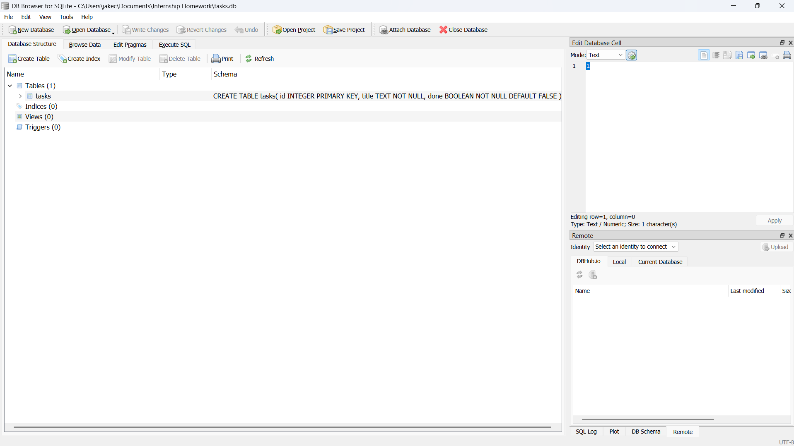

# Task API

A simple CRUD API built with Node.js and Express.js.

## Setup

Clone the repository and install the dependencies:

```bash
git clone <your-repository-url>
cd <your-project-folder>
npm install
```

Start the server:

```bash
node server.js
```

The API will be available at:

```text
http://localhost:3000
```
### Why SQLite?

SQLite was chosen for this project because it provides a simple way to add persistent database storage without requiring a separate database server.

Single file: The entire database is stored in a single tasks.db file.
Zero setup: No database server or additional database configuration is required.
Persistent storage: Data survives server restarts, unlike the previous in-memory implementation.
Database

The SQLite database is stored in:
```
tasks.db
```

The file is created automatically when the application starts if it does not already exist.

`tasks.db` is normally included in `.gitignore` so that the database file is not committed to the repository. This allows each fresh clone of the project to create its own database.

On a fresh setup, the application automatically initializes the database and creates the example tasks required for the project.

## Swagger Documentation

API documentation is available at:

```text
http://localhost:3000/api-docs
```

## Endpoints

| Method | Endpoint                | Description   |
| ------ | ----------------------- | ------------- |
| GET    | `/tasks`                | Get all tasks |
| GET    | `/tasks/:id`            | Get a task    |
| POST   | `/tasks`                | Create a task |
| PUT    | `/tasks/:id`            | Update a task |
| DELETE | `/tasks/:id`            | Delete a task |
| GET    | `/tasks?search=keyword` | Search tasks  |

## Example

Create a task:

```bash
curl -X POST http://localhost:3000/tasks \
  -H "Content-Type: application/json" \
  -d '{"title":"Buy milk"}'
```

Get all tasks:

```bash
curl http://localhost:3000/tasks
```

Search for a task:

```bash
curl "http://localhost:3000/tasks?search=milk"
```

## Notes

This API uses SQLite for persistent task storage. The database is created and initialized automatically when the server starts.


## AI vs ME

My prompt:
```
I want you to configure this server.js from the ai-version folder. What I want you to create is a full CRUD API. Don't analyze other files from this workspace. I want you to create it from the scratch without taking any context from other files.

You will use Javascript as the main language and ExpressJS as the framework.
You will have this following endpoints: "/tasks", "/health", "/", "/tasks/:id", "/tasks?search=".
Utilize appropriate http status codes while incorporating suitable validation rules.

All the data for the tasks will be an in-memory list. Incorporate also the SwaggerUI for the testing of endpoints.
```

Key differences I have encountered compared to my own code : 

```
1. AI-generated code have separated the section for documenting the endpoints for the SwaggerUI unlike mine that has a documentation at the top of each endpoints. 

2. It made a helper function for parsing and validating numerical ID.

3. The validation check for each endpoint is great because it handled all possible edge.

4. It made a handler for undefined routes and for global error for errors such as internal server error and malformed JSON payload.
```


## Swagger UI Screenshot



## Database Verification

I manually updated the `tasks` table using DB Browser for SQLite and verified the change through the API without restarting the server.

**Query used:**

```sql
SELECT * FROM tasks WHERE done = 1;
```

**Result:**

The query returned the updated task records, including `1 | I did my homework | 1` and `4 | Bought milk | 1`, confirming that the API reads the current database state without requiring a server restart.

### Database Structure

